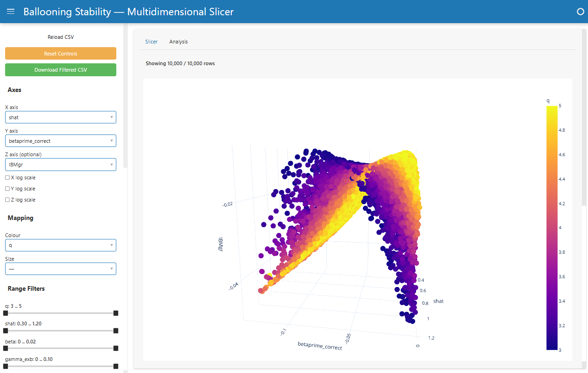

# Ballooning Stability — Multidimensional Slicer

Interactive exploration tool for tokamak ideal-ballooning stability data. Built with **Panel** + **Plotly**.



## Quick Start

```bash
# Create virtual environment and install deps
python3 -m venv .venv
source .venv/bin/activate
pip install -r requirements.txt

# Launch the app (uses data/IdealBallooningSamples.csv by default)
panel serve gui/app.py --show --autoreload

# Or point at a different CSV
SLICER_CSV=data/kappa_delta_5k_narrow.csv panel serve gui/app.py --show --autoreload
```

The browser will open at `http://localhost:5006/app`.

## Features

### Slicer Tab

- **2D / 3D scatter**: pick X, Y, and optional Z axes from all numeric columns
- **Colour & size mapping**: map any numeric column to point colour or size
- **Boolean filters**: toggle `isapar` / `isbpar` (Any / True / False)
- **Discrete selectors**: multi-select for low-cardinality columns like `psi_n`
- **Range sliders**: auto-generated for every continuous numeric column
- **Axis log scale**: per-axis toggle
- **CSV reload**: re-read data without restarting the server
- **Reset controls**: restore all widgets to defaults
- **Download**: export filtered data as CSV

### Analysis Tab

- **Pearson correlation ranking**: horizontal bar chart showing correlation of each variable with `IBMgr`, updated reactively as filters change
- **1D marginal histograms**: strip of histograms for all varying columns
- **2D pairplot**: NxN grid of `Histogram2d` (off-diagonal) and `Histogram` (diagonal) for selected columns, with selectable columns via checkbox (defaults to top 6 by correlation)

### IBMgr Generator (CLI)

- **`ibm/generate_ibmgr.py`**: grid-based geometry scans wrapping [pyrokinetics](https://github.com/pyro-kinetics/pyrokinetics)
- **`ibm/generate_kappa_delta_scan.py`**: random kappa-delta scans with marginal kinetic sampling and `--nice` CPU throttling
- **Parallel execution**: `--workers N` flag for multiprocessing (spawn context)
- **Incremental saves**: partial results written to CSV during long runs; safe to interrupt with Ctrl-C
- **Tested**: 5,000-point κ-δ scan completed with 0 failures

## Running Tests

```bash
source .venv/bin/activate
python -m pytest tests/ -v
```

Tests also run automatically on push/PR via GitHub Actions.

## Project Structure

```
gui/                    # Slicer application
  app.py                  Panel app — slicer + analysis tabs
  data_utils.py           Data loading, cleaning, column classification

ibm/                    # IBMgr generation tools
  ibm_generator.py        Core library (pyrokinetics wrapper)
  generate_ibmgr.py       Grid-based scan CLI
  generate_kappa_delta_scan.py  Random scan CLI
  validate_ibmgr.py       Cross-validation script

data/                   # Datasets (committed)
  IdealBallooningSamples.csv    Original 10k dataset
  kappa_delta_5k_narrow.csv     5000 samples, δ ∈ [0.3, 0.8]
  input2.cgyro                  CGYRO template
  fixture.csv                   100-row test fixture

tests/                  # Test suite (53 tests)
  test_app.py             App tests
  test_data_utils.py      Data layer tests
  test_ibm_generator.py   Generator tests (pyrokinetics mocked)
  conftest.py             Test fixture configuration
```
